<div align="center">
  <a href="https://carlosguedes-dev.github.io/carlosguedes-dev/">
    <picture>
      <source media="(prefers-color-scheme: dark)" srcset="./dark.svg">
      <source media="(prefers-color-scheme: light)" srcset="./light.svg">
      
    </picture>
  </a>
</div>

Sou um **Engenheiro de Software** e Desenvolvedor apaixonado por criar experiências digitais premium, interativas e altamente tecnológicas. Meu foco está na união perfeita entre **código de precisão, interfaces que impressionam e arquitetura que escala**. Acredito que o design e a tecnologia devem caminhar juntos para entregar produtos excepcionais e imersivos.

## 🚀 Sobre mim
- 💡 Construo aplicações web modernas, com foco extremo nos detalhes visuais (UI/UX), utilizando animações fluidas, efeitos 3D e interfaces arrojadas.
- 🛠️ Possuo domínio em **JavaScript**, **TypeScript**, e exploro ao máximo o potencial de tecnologias nativas (Vanilla CSS, Canvas API, WebGL/Three.js) para criar experiências que não dependem de frameworks pesados para brilhar.
- 🎨 Tenho um grande apreço por **Design Premium**: utilizo vidro (glassmorphism), paletas harmoniosas, microinterações e tipografias de ponta.
- ⚙️ Desenvolvo soluções Full-Stack escaláveis, explorando ecossistemas modernos (React, Next.js, Vite, Node.js).
- 🚀 Busco constantemente expandir meus conhecimentos, englobando também IA, segurança e arquitetura de sistemas.

## 📞 Contato
Vamos construir algo incrível juntos!
- **WhatsApp:** [(53) 99141-1935](https://wa.me/5553991411935)
- **E-mail:** carlosguedes0007@gmail.com
- **Portfólio:** [carlosguedes-dev.github.io/carlosguedes-dev](https://carlosguedes-dev.github.io/carlosguedes-dev/)

---

<br>

# 📂 Sobre este Repositório (Meu Portfólio Pessoal)

Este repositório (`carlosguedes-dev`) abriga o código-fonte do meu site pessoal/portfólio. Este projeto foi desenvolvido para refletir a minha abordagem como engenheiro de software de forma prática.

O design utiliza uma estética imersiva com elementos de HUD (Heads-Up Display), efeitos 3D orientados por scroll e um sistema de partículas iterativo via Canvas API, proporcionando uma experiência de navegação fluida e tecnológica.

🔗 **Acesse o site:** [carlosguedes-dev.github.io/carlosguedes-dev](https://carlosguedes-dev.github.io/carlosguedes-dev/)

## ✨ Features Principais

- **Sistema de Partículas (Canvas):** Fundo interativo gerado dinamicamente com atração pelo cursor do mouse.
- **Scroll em Profundidade (Z-Depth):** Navegação baseada em *parallax* no eixo Z, criando a ilusão de mergulho no conteúdo.
- **HUD Dinâmico:** Interface persistente com telemetria simulada (coordenadas do mouse, FPS, progresso do scroll e horário).
- **Pixel-Perfect & Responsivo:** Design cuidadosamente ajustado via Vanilla CSS para funcionar perfeitamente em dispositivos móveis e desktops.
- **Efeitos Typograficos & Glitch:** Animações CSS avançadas e efeitos de digitação nativos para maior imersão.

## 🛠️ Tecnologias Utilizadas

Este projeto foi construído priorizando performance e controle absoluto, sem depender de frameworks pesados para a interface:

- **Vite:** Build tool ultrarrápido para desenvolvimento e empacotamento.
- **TypeScript:** Para lógica de interface e controle do Canvas com tipagem estática e segurança.
- **HTML5 (Semântico):** Estrutura clara e acessível.
- **Vanilla CSS (CSS3):** Estilização avançada, variáveis CSS, animações complexas (`@keyframes`) e layouts modernos (Flexbox/Grid).
- **GitHub Actions:** Pipeline automatizada (CI/CD) para deploy no GitHub Pages.

## 🚀 Como Rodar Localmente

Siga os passos abaixo para rodar o projeto na sua máquina:

### Pré-requisitos
- Node.js (versão 18 ou superior recomendada)
- NPM (ou outro gerenciador de pacotes da sua preferência)

### Instalação

1. Clone o repositório:
   ```bash
   git clone https://github.com/carlosguedes-dev/carlosguedes-dev.git
   ```
2. Entre no diretório do projeto:
   ```bash
   cd carlosguedes-dev
   ```
3. Instale as dependências:
   ```bash
   npm install
   ```
4. Inicie o servidor de desenvolvimento:
   ```bash
   npm run dev
   ```
5. Abra o navegador no endereço indicado (geralmente `http://localhost:5173`).

### Build para Produção

Para gerar os arquivos otimizados para produção:
```bash
npm run build
```
Os arquivos compilados estarão na pasta `dist/`.

## ⚙️ Arquitetura de Deploy

O deploy deste projeto é totalmente automatizado utilizando **GitHub Actions**. Qualquer alteração empurrada (*pushed*) para a branch `main` engatilha o workflow definido em `.github/workflows/deploy.yml`.

A action realiza os seguintes passos:
1. Instalação das dependências.
2. Build do projeto otimizado pelo Vite.
3. Push automático da pasta `dist/` para a branch `gh-pages`.
4. O GitHub Pages lê a branch `gh-pages` e atualiza o site no ar instantaneamente.

---
*Projetado e desenvolvido por Carlos Guedes. © 2026 Todos os direitos reservados.*
